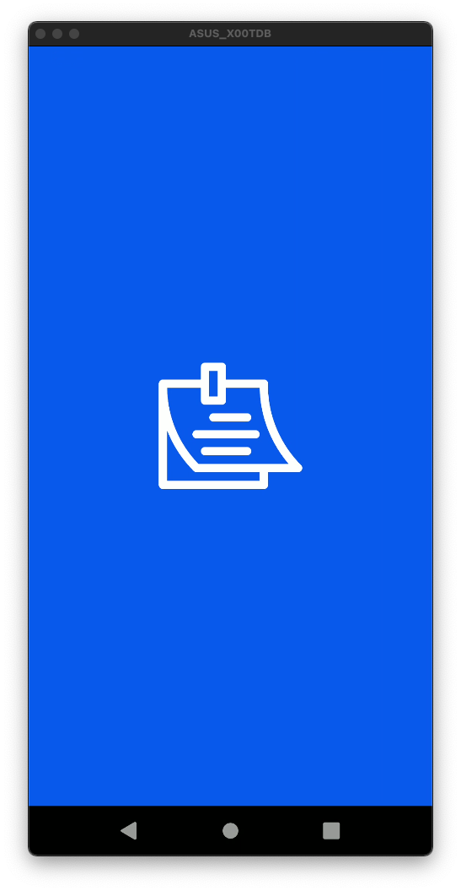
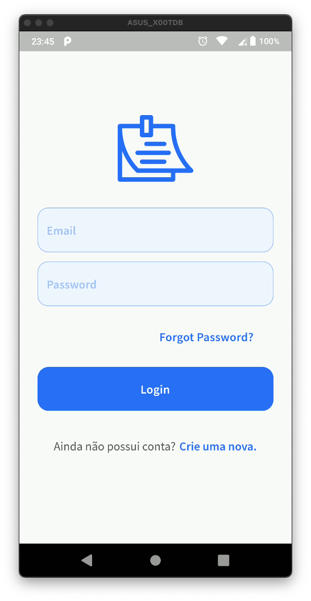
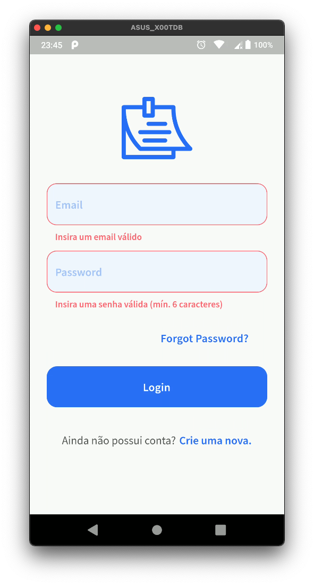
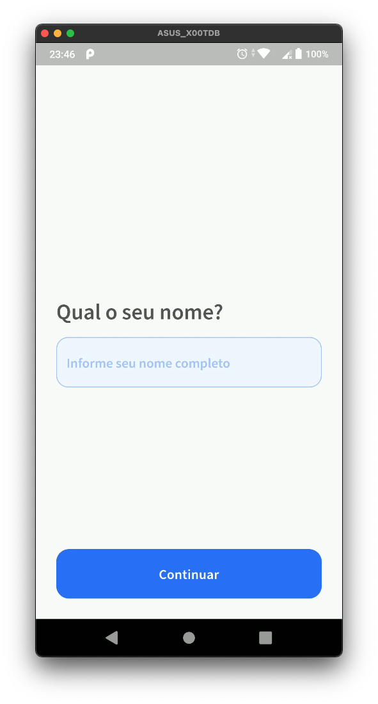
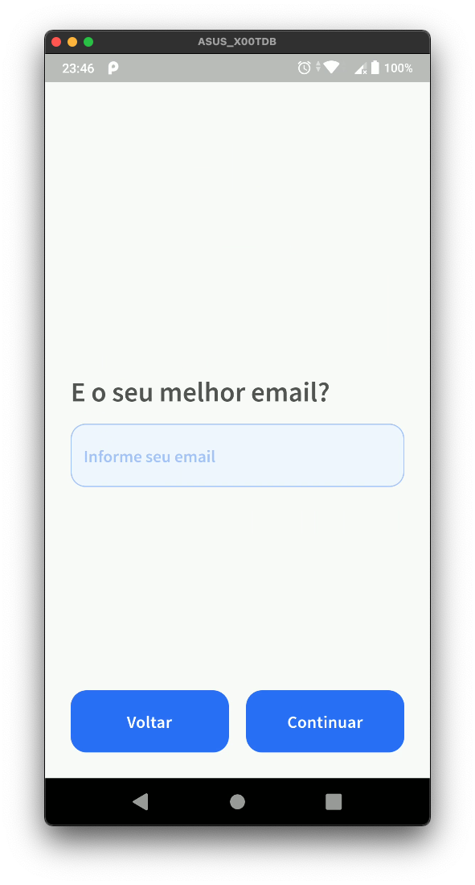
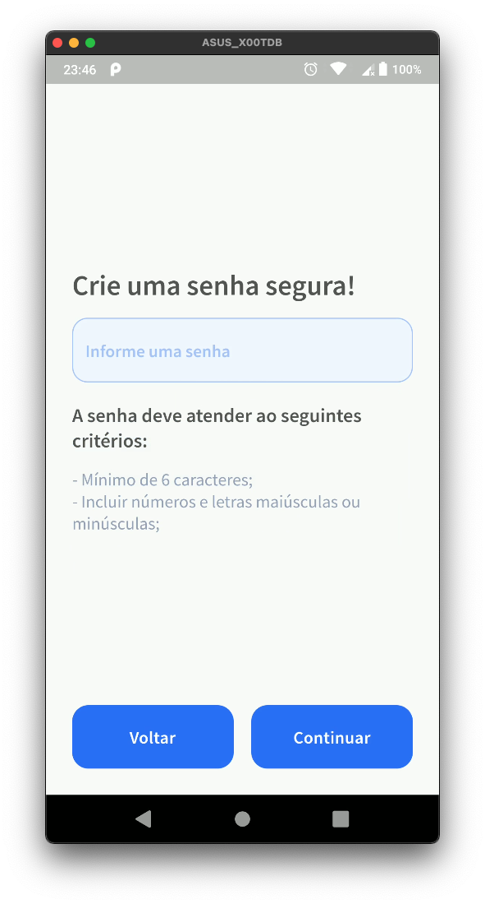
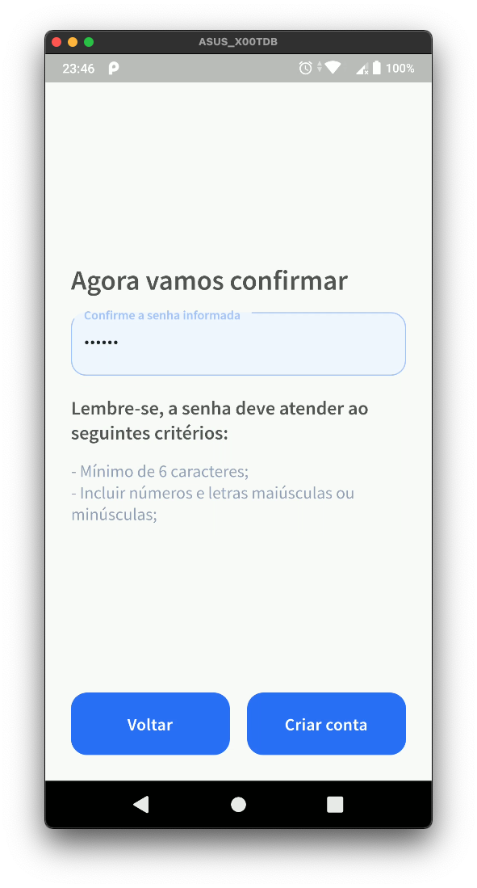
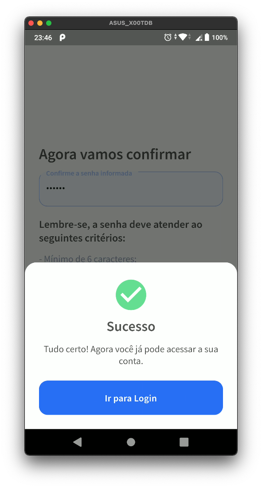
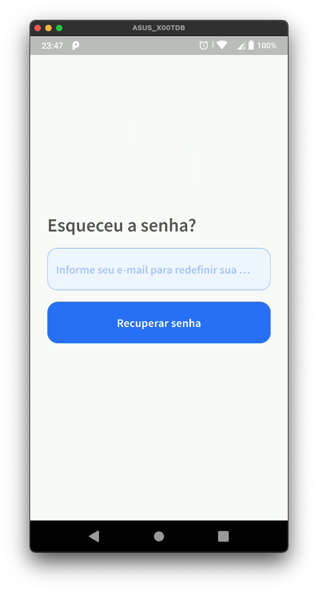
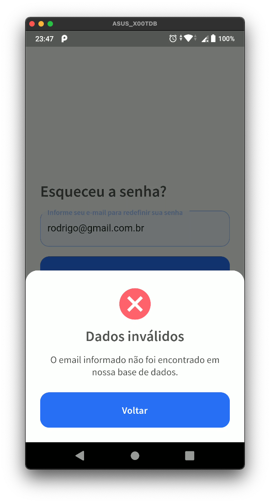

# LevelUP#3

O levelUP dessa semana consiste em criar um sistema de login.

## Features

- Login (tela)
- Criar conta(tela)
- Recuperar senha(tela)
- Validação de campos ( com textFormField e na lógica)

## Práticas

- Componentização
- Uso do setState
- Form / TextFormFields / Validation
- Navegação nomeada / Navigator 2.0
- Customização de widgets básicos
- Criação de Controllers e Validators para implementação/apoio as regras de negócio 
- Passagem de parâmetros entre pages/rotas
- Uso do localstorage

## Packages 

- google_fonts: ^2.1.0 
- shared_preferences: ^2.0.6
- flutter_native_splash: ^1.2.0

## Melhorias

- Melhorar mensagem de erro exibida quando o email do usuário já estiver cadastrado
- Implementar tratamento de exceções para caso SharedPreferences venha falhar
- Implementar serviço para uso do SharedPreferences, afim de encapsular/centralizar código

## Screenshots
 

## Inspirações

- [Link 1 - search.muz.li](https://search.muz.li/NWZjNTk4ZGMz)
- [Link 2 - uplabs.com](https://www.uplabs.com/posts/butrfly-social-ui-kit-sign-in-sign-up)
- [Link 3 - dribbble.com](https://dribbble.com/shots/6443653-Register-Steps-Mobile-App/attachments/6443653-Register-Steps-Mobile-App?mode=media)
